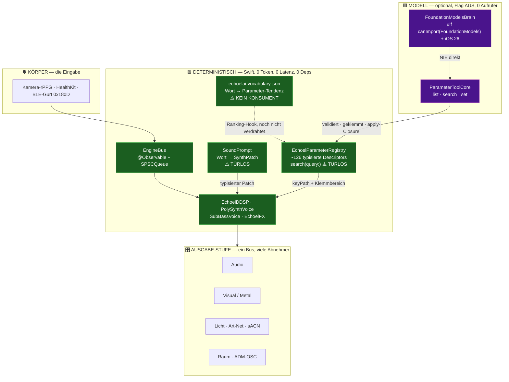

# DSPy für Echoelmusic — Deep Research, Architektur-Entscheid und Roadmap

**Datum:** 2026-07-31 · **Auftrag:** Founder, wörtlich *„Du entscheidest alles auf höchstem
Vision Niveau."* · **Rolle:** Lead Software Architect · **Status:** ENTSCHIEDEN

> **Warum diese Datei in `scratchpads/` liegt und nicht unter `docs/architecture/`, wie der
> Auftrag sagte.** `docs/` ist in diesem Repo **die veröffentlichte GitHub-Pages-Website**,
> nicht der interne Dokumentationsordner. Ein Architektur-Bericht dort wäre öffentlich, und
> drei abgeschlossene Aufgaben (#158, #192, #249) bestanden ausschliesslich daraus, falsche
> Behauptungen wieder aus `docs/` zu entfernen. Interne Architektur- und Rechercheberichte
> leben hier; das ist die bestehende Konvention (`STRATEGY_*`, `PLAN_*`, `ARCHITECTURE_AUDIT_*`).

---

## 1. Executive Summary — der Entscheid in fünf Sätzen

**DSPy wird NICHT als Abhängigkeit aufgenommen. Das Konzept dahinter ist in Echoelmusic
bereits implementiert — in Swift, deterministisch, mit null Tokenkosten.** Der Auftrag
beschreibt ein Backend mit Python-Audio-Workern, API-Routen, VST-Parametern und bestehender
Prompt-Logik; **keines davon existiert in diesem Repository** (Abschnitt 2 belegt jede
Position einzeln). Die drei genannten Anwendungsfälle sind bei genauer Prüfung: **einer ist
gebaut und hat nur seine Tür verloren** (`SoundPrompt`, seit heute türlos), **einer ist
ausserhalb des Produkts** (Arrangement/Metadaten wurden mit #121 bewusst entfernt), **einer
ist auf iOS nicht ausführbar** (Ollama/Llama/Phi laufen nicht in einer ausgelieferten
iPhone-App; der Gerätepfad ist Apples FoundationModels). Der eigentliche Wert des Auftrags
liegt woanders und ist real: **die Sprache→Parameter-Fähigkeit, die Du seit heute Vormittag
dreimal in verschiedenen Worten angefragt hast, ist zu ~80 % gebaut und hat keine Tür.**

**Der Entscheid, in einem Satz:** statt eine Python-Abhängigkeit einzuführen, um Prompts zu
kompilieren, machen wir die drei vorhandenen, deterministischen Swift-Bausteine erreichbar —
`SoundPrompt` (Wort → Patch), `EchoelParameterRegistry.search` (Wort → Parameter) und
`echoelai-vocabulary.json` (Wort → Parameter-Tendenz) — und bekommen damit **genau die
Fähigkeit aus Anwendungsfall 1, sofort, offline, ohne Modell und ohne Latenz.**

---

## 2. Prämissen-Audit — was der Auftrag annimmt vs. was das Repo ist

Jede Zeile am Code geprüft. Das ist kein Widerspruch um seiner selbst willen: **jede falsche
Prämisse hier hätte einen Arbeitsmonat in eine Schicht investiert, die es nicht gibt.**

| Annahme im Auftrag | Befund im Repo | Beleg |
|---|---|---|
| „backend, API routes" | Es gibt **keinen Server und keine API**. Eine iPhone-App, sonst nichts. | `Package.swift` definiert eine Library + App-Target; kein Web-Target |
| „Python audio worker pipeline" | Existiert nicht. **Swift 100 %.** Die 135 `.py`/`.ts`-Dateien im Repo liegen ausnahmslos in `.claude/skills/`, `scripts/` und `ContentPipeline/` — Werkzeuge, niemals ausgeliefert | `git ls-files` gefiltert; keine unter `Sources/` |
| „introduce `dspy` into our dependencies" | `Package.swift` führt **`dependencies: []`** auf Paket- UND Target-Ebene. „Add dependencies without asking" steht wörtlich unter DO NOT in `CLAUDE.md`; Prinzip 2 der Verfassung lautet „open standards, near-zero dependencies, no SDK lock-in" | `Package.swift:34-35`, `:41` |
| „typed Audio/**VST** parameters" | **Kein VST.** Und das AUv3-Target wurde mit #121 Slice 1 entfernt — bewusst, per Founder-Entscheid | `git grep VST -- Sources` → 0 |
| „Track & **Arrangement** Metadata … Verse/Drop/Outro" | Arrangement, Timeline und Clips sind mit **#121 Slice 4 gelöscht**. Es gibt keine Alben, Tracklisten, Setlists oder Stems — als Begriffe null Treffer | `git grep -l Album/Tracklist/Setlist/Stem -- Sources` → 0/0/0/0 |
| „existing text-generation … AI-driven prompt logic … lose Prompt-Strings, JSON-Parsing-Fehler" | Es gibt **keinen einzigen LLM-Prompt in Produktion**. `Sources/Echoelmusic/EchoelAI/` (3 Dateien) hat **null Aufrufer** ausserhalb sich selbst, `FeatureFlags.echoelAI` ist default AUS, Release bit-identisch | `git grep BrainBackend\|ParameterToolCore -- Sources` ausserhalb des Ordners → 1 Kommentarzeile |
| „local models (Ollama / Llama 3 / Phi-3)" | Auf einem ausgelieferten iPhone nicht ausführbar. Der Gerätepfad ist **Apples FoundationModels** (`#if canImport(FoundationModels)` + iOS 26) | `EchoelAI/FoundationModelsBrain.swift` |
| „`docs/architecture/…`" | `docs/` ist **die öffentliche Website** | siehe Kopfnotiz |

**Die eine Prämisse, die stimmt:** dass strukturierte, typisierte, validierte Parameter-
Ausgaben wertvoller sind als freie Textgenerierung. Genau darauf baut alles Folgende auf.

---

## 3. Die drei Anwendungsfälle, einzeln entschieden

### 3.1 Structured Preset / Parameter Generator — **GEBAUT. Und seit heute türlos.**

Das ist der wichtigste Befund dieses Berichts.

`Sources/Echoelmusic/DSP/SoundPrompt.swift` **ist bereits exakt das, was eine DSPy-Signature
für diesen Zweck wäre** — nur ohne Modell, ohne Netz, ohne Token und ohne Latenz:

- **Vokabular** von 24 Klang-Deskriptoren (`warm`, `bright`, `dark`, `airy`, `metallic`,
  `glassy`, `plucky`, `drone`, `evolving`, `huge` …) plus **Intensitäts-Modifikatoren**
  (`very` ×1,6 · `quite` ×1,25 · `slightly` ×0,5).
- **Typisierte Zielstruktur:** die Wörter schreiben in einen `SynthPatch` — Charakter,
  Filter, Hüllkurve, Raum.
- **Bereichs-Validierung ist eingebaut und wird an anderer Stelle als Referenz zitiert:**
  `c01(...)` klemmt auf 0…1, `min(max(p.filterLFORate, 0), 12)` auf 0–12 Hz. `EchoelDDSP`
  nennt `SoundPrompt` in seinem eigenen Cutoff-Doc als eine der vier kanonischen
  Klemm-Stellen, und `FilterCutoffClampTests` prüft die Übereinstimmung **behavioural**.
- **Unbekannte Wörter werden ignoriert — „never throws, never garbles".** Das ist genau die
  Garantie, für die man in DSPy `Assert`/`Suggest` und einen Retry-Loop bräuchte.
- **Vorschläge sind mitgeliefert:** `"warm lush pad"`, `"deep dark drone"`,
  `"punchy metallic lead"`, `"huge cinematic drone"` …

Ein LLM würde hier ein reines Nachschlagen durch eine Netzwerk- oder Modell-Latenz ersetzen,
Nichtdeterminismus einführen (derselbe Prompt → anderer Klang) und die Privatheit brechen,
die der Datei-Kopf ausdrücklich als Entwurfsziel nennt.

> ⛔ **UND ES HAT HEUTE NULL PRODUKTIONS-AUFRUFER.** Der Datei-Kopf behauptet *„the editor
> calls `apply` and offers `suggestions`"* — es gibt keinen solchen Aufrufer. Ich habe die
> heute gelöschte `PatchEditorView.swift` (#132 Slice 6, `8d31c21`) im Elterncommit geprüft:
> **auch sie rief `SoundPrompt` nicht auf.** Der Klon ist shallow (gepfropft auf `24e9420`),
> also lässt sich nicht belegen, was es historisch je aufrief — belegbar ist nur die
> Gegenwart: eine fertige, getestete, geklammerte Sprache→Klang-Fähigkeit ohne Tür, deren
> eigener Kopf eine Tür behauptet. Dasselbe Muster, das dieses Repo „Mechanismus richtig,
> Begründung falsch" nennt.

**Entscheid: ADOPT — als Tür, nicht als Abhängigkeit.** Siehe Roadmap S1.

### 3.2 Track & Arrangement Metadata / Sentiment Extraction — **AUSSERHALB DES PRODUKTS**

Nicht „zu teuer", sondern **per Founder-Entscheid entfernt**. Die kanonische
Produktdefinition vom 2026-07-25 zieht die Grenze, die jede Keep/Cut-Frage entscheidet:

> *Geht es um den Klang, der **jetzt** entsteht (BEHALTEN) — oder um das Anordnen von
> Material **über die Zeit** (STREICHEN)?*

Genre-, Mood- und Struktur-Tagging (Verse/Drop/Outro) über eine Bibliothek ist die
Streichen-Seite, und zwar wörtlich: Timeline, Arrangement und Clips sind mit #121 Slice 4
gelöscht, „DMMW" ist als Produktbegriff zurückgezogen. Zusätzlich: **Genre, Tonart und Tempo
sind in Echoelmusic keine zu extrahierenden Metadaten — sie sind EINGABEN**, die der Spieler
vor dem Generieren wählt (`MusicStyle` mit 33 Fällen, `MusicalKey`, `BodyTempoField`).
Ein Modell zu bauen, das errät, was der Nutzer eine Sekunde vorher selbst eingestellt hat,
ist keine Fähigkeit.

**Entscheid: REJECT.** Wenn Du eine Bibliotheks-/Katalog-Fläche willst, ist das ein neues
Produkt und eine Founder-Entscheidung — kein DSPy-Thema.

### 3.3 Optimierte lokale LLM-Ausführung (GEPA / MIPROv2 auf Ollama) — **NICHT AUSFÜHRBAR**

Zwei unabhängige harte Gründe, jeder allein ausreichend:

1. **Ein Optimierer optimiert gegen ein Modell, das er ansteuern kann.** Apples
   On-Device-Foundation-Model ist aus Python nicht ansteuerbar. Gegen ein Cloud-Modell
   kompilierte Instruktionen auf ein ~3B-Gerätemodell zu übertragen ist unbelegbar — und
   „unbelegbar" ist in diesem Repo ein Ausschlusskriterium, kein Restrisiko.
2. **DSPys ganzer Wert hängt an einer METRIK.** Echoelmusics tatsächliche Messlatte ist
   „klingt professionell" / „wow". Diese Metrik ist heute das Ohr des Founders. **Ohne
   messbares Ziel ist ein Prompt-Optimierer nur ein langsamerer Prompt.**

**Entscheid: REJECT — aber die Lehre wird übernommen.** Siehe Abschnitt 5.

---

## 4. Architektur — die reale Schichtung („Grün vor Lila", schon erfüllt)

**Was diese Zeichnung zeigt und der Auftrag nicht erwartet hätte:** die Trennung „Grün vor
Lila" ist hier **nicht zu bauen, sondern schon Gesetz** — als ADR festgeschrieben
(*„das Modell schreibt NIE direkt DSP-State"*): das Modell darf nur Werkzeuge aufrufen, die
gegen die Registry validieren und über die Descriptor-Grenzen klemmen. Das ist strenger als
alles, was DSPys `Assert`/`Suggest` erzwingen, weil es keine Retry-Schleife ist, sondern ein
Typ- und Schreibpfad-Verbot.

**Die drei ⚠️ in der grünen Schicht sind die eigentliche Arbeit.** Nicht die lila.

---

## 5. Der übertragbare Gedanke — und er ist heute schon terminiert

DSPys wertvollste Lehre ist nicht der Optimierer. Sie ist: **ohne messbares Ziel kann man
nicht optimieren.** Echoelmusic hat genau eine Stelle, an der eine echte, zero-dep Metrik
ansteht und bereits beauftragt ist:

- **#313 Slice 2** — Preset-Lautheit per **BS.1770-Messbank** über den vorhandenen
  `EchoelLoudnessMeter`, statt der heutigen Fünf-Skalar-Heuristik (deren Unison-Term
  nachweislich das falsche Vorzeichen hat).
- Blockiert hinter **#316** — die LUFS/True-Peak-Anzeige misst **vor** der gesamten
  Master-Kette. Das Messgerät ist selbst falsch.

**Reihenfolge steht: #316 vor #313 Slice 2.** Dieser Bericht schafft dafür keinen neuen Task
und keine neue Abhängigkeit — er bestätigt eine Priorität, die schon gesetzt ist.

---

## 6. Roadmap — kleine, isolierte, testbare Scheiben

Jede Scheibe ist ein Ralph-Zyklus: ≤3 Dateien, Wächter in `Tests/CISmoke`, beide echten Gates
grün. **Keine davon fügt eine Abhängigkeit hinzu. Keine davon berührt den Audio-Thread.**

| # | Scheibe | Warum sie zuerst / später kommt |
|---|---|---|
| **S1** | **`SoundPrompt` bekommt seine Tür zurück** — Textfeld + Vorschlags-Chips im `soundPanel` (dem lebenden Timbre-Editor hinter dem Sound-Chip), `apply` auf den aktuellen Patch | **Höchster Wert pro Zeile im ganzen Bericht.** Fertige, getestete, geklammerte Fähigkeit, null Risiko, beantwortet Anwendungsfall 1 vollständig. Kein neuer Sheet — die Modal-Decke bleibt unberührt |
| **S2** | Wächter: `SoundPrompt` hat einen Produktions-Aufrufer, und sein Datei-Kopf sagt die Wahrheit | Genau der Defekt, der ihn unbemerkt türlos werden liess |
| **S3** | **Parametersuche** — `EchoelParameterRegistry.search(query:)` eine Tür geben: tippen, Treffer sehen, zur Zeile springen | Löst Ursache 3 von #310 („ein Parameter hat keine Adresse") allein, ohne neues Layoutmodell |
| **S4** | `echoelai-vocabulary.json` an den **Ranking-Hook** hängen, den `search` in seinem eigenen Doc schon vorsieht — „dunkler" gewichtet Cutoff/Air/Damping hoch | Macht S3 semantisch, weiter ohne Modell. Der Hook ist im Code bereits benannt |
| **S5** | `SoundPrompt`-Vokabular und `echoelai-vocabulary.json` auf **eine Quelle** ziehen | Zwei Wortlisten für dieselbe Aufgabe driften garantiert auseinander |
| **S6** | **#316** — LUFS/True-Peak hinter die Master-Kette | Das Messgerät zuerst |
| **S7** | **#313 Slice 2** — BS.1770-Messbank, gemessene statt geschätzter Preset-Trims | Die erste echte Metrik des Projekts |
| **S8** | `SoundPrompt` deutschsprachig (`warm`/`hell`/`dunkel`/`weit`) | #232 International; die Tendenz-Datei ist bereits deutsch |
| **S9** | `ParameterApplyRouter` bekommt die konkrete Apply-Closure für die Registry-keyPaths | Schliesst das ADR-Loch, ohne das Modell einzuschalten |
| **S10** | **Erst dann** Founder-Entscheid: `FeatureFlags.echoelAI` auf einem iOS-26-Gerät testweise an | Ein Modell einschalten, dessen deterministischer Unterbau vollständig und erreichbar ist — nicht davor |

**Was bewusst NICHT in der Liste steht:** `dspy` in `Package.swift`, ein Python-Worker, ein
Vektor-Index, Ollama, ein Metadaten-Extraktor.

---

## 7. Offene Fragen an den Product Owner

1. **Ist die Prämisse „Song-/Stem-/Album-Verwaltung" ein neuer Produktwunsch — oder war der
   Auftragstext generisch?** Das entscheidet alles: heute ist Echoelmusic per Deiner eigenen
   Entscheidung vom 2026-07-25 ein Instrument ohne Bibliothek. Eine Katalog-Fläche wäre kein
   Feature, sondern ein zweites Produkt.
2. **Soll `SoundPrompt` beim Anwenden den bestehenden Patch VERÄNDERN oder ERSETZEN?** Heute
   addiert es gewichtet auf das Vorhandene. Beides ist vertretbar; die Erwartung ist bei
   einem Textfeld typischerweise „ersetzen", das Verhalten heute ist „verfeinern".
3. **Deutsch oder Englisch als Eingabesprache für die Klangwörter — oder beides?** Das
   Vokabular ist heute englisch, die Tendenz-Datei deutsch.
4. **Darf die Parametersuche (S3) auch SETZEN, oder nur FINDEN?** Nur-finden ist risikofrei;
   setzen bräuchte einen Undo-Weg, den es für Patch-Änderungen heute nicht gibt.
5. **Bleibt „kein Modell in v1.0" die Linie?** Mein Entscheid oben geht davon aus. Wenn Du
   Apple Intelligence in v1.0 willst, ändert das S9/S10 von „später" auf „geplant" — die
   deterministische Grundlage bliebe identisch.

---

## 8. Ledger

`inspiration.csv` (2026-07-31): DSPy = **REJECT als Abhängigkeit · ALREADY-ADOPTED als
Konzept**. Dieser Bericht ist die ausführliche Begründung dazu und ersetzt sie nicht.
